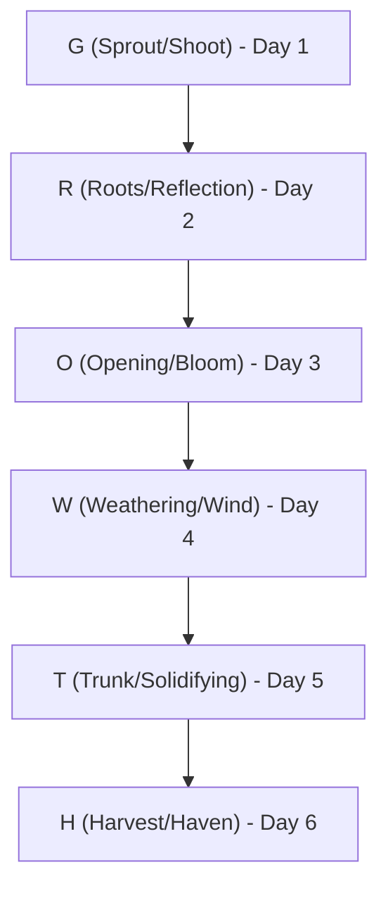

# mydither — The GROWTH Progression Spec

A 6-day daily motion & design practice. Nature in, dither out.
Every day hides one letter of the word **G-R-O-W-T-H** in the paper grain. The visual motion of each post follows the lifecycle of growth.

---

---

## The 6 Stages of GROWTH

### **1. G — Sprout / Shoot (Day 001)**
* **Theme:** Origin, germination, and the initial upward push.
* **Art Motif:** A branch (stem) and twigs staggering out.
* **Motion:** The shoot rises up from the earth; a dot (sun/seed) materializes above it.

### **2. R — Roots / Reflection (Day 002)**
* **Theme:** Mirroring, grounding, and anchoring.
* **Art Motif:** A horizon line, a dot (sun) on it, and its broken reflection in the water.
* **Motion:** The sun materializes; its reflection leaks smoothly downwards like roots seeping into the soil, grounding the growth.

### **3. O — Opening / Bloom (Day 003)**
* **Theme:** Expansion, release, and unfolding.
* **Art Motif:** Radial symmetry, circles, ripples, or budding shapes.
* **Motion:** Centrifugal expansion. Ring-like structures or petals unfurling outward from a central point.

### **4. W — Weathering / Wind (Day 004)**
* **Theme:** Resilience, flexibility, and element adaptation.
* **Art Motif:** Bending limbs, waves, or wind-swept textures.
* **Motion:** Fluid oscillation. Stems swaying or waves rolling horizontally, adapting to the pressure.

### **5. T — Trunk / Solidifying (Day 005)**
* **Theme:** Strength, verticality, and permanent structure.
* **Art Motif:** Anchored vertical vectors, thick lines, or crossing grids.
* **Motion:** Upward thrust and lock. Heavy vertical segments rise and seat firmly, forming a strong spine.

### **6. H — Harvest / Haven (Day 006)**
* **Theme:** Maturity, completion, shelter, and starting anew.
* **Art Motif:** Dense canopy, falling seeds, or a vast landscape.
* **Motion:** Soft drift and release. Seeds falling down to return to the soil, restarting the cycle of **G**.
